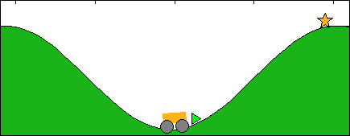
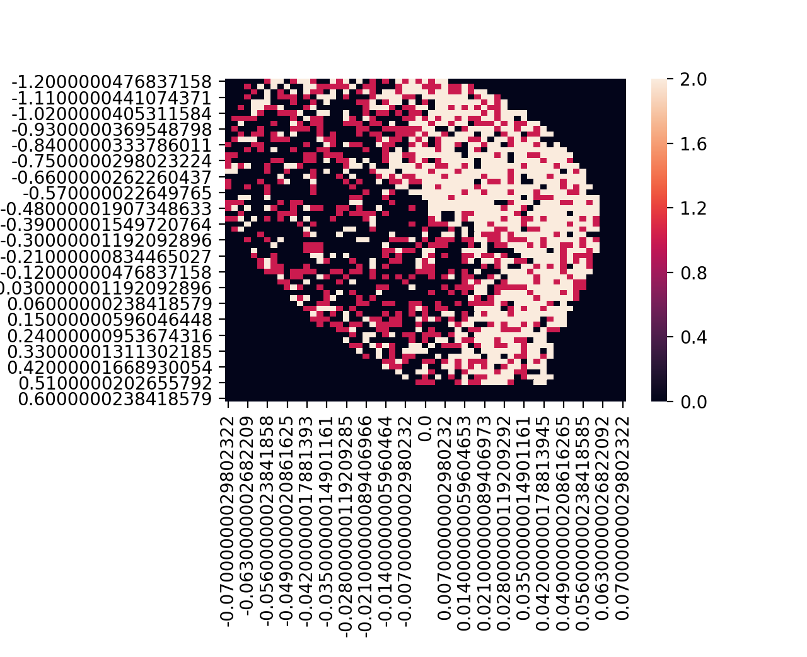

# Reinforcement Learning: Mountain Car Problem

## Problem Domain
Reinforcement learning (RL) is an area of machine learning concerned with how software agents ought to take actions in an environment so as to maximize some notion of cumulative reward. [1]

This project applies reinforcement learning to the mountain-car problem. Mountain Car, a standard testing domain in Reinforcement Learning, is a problem in which an under-powered car must drive up a steep hill. Since gravity is stronger than the car's engine, even at full throttle, the car cannot simply accelerate up the steep slope. The car is situated in a valley and must learn to leverage potential energy by driving up the opposite hill before the car is able to make it to the goal at the top of the rightmost hill. [2]

Description of variables in code

## Methodology & Results

This project makes use of OpenAI's Gym environment in order to train a Q-Learning algorithm to solve the mountain car problem.

The environment was discretized into 60 bins with a learning rate of 0.8 trained over 10 000 episodes. A heatmap of the state plotted against the cars position was visualized:

## Variables:

- **observation (object):** an environment-specific object representing your observation of the environment. For example, pixel data from a camera, joint angles and joint velocities of a robot, or the board state in a board game.

- **reward (float):** amount of reward achieved by the previous action. The scale varies between environments, but the goal is always to increase your total reward.

- **done (boolean):** whether it's time to reset the environment again. Most (but not all) tasks are divided up into well-defined episodes, and done being True indicates the episode has terminated. (For example, perhaps the pole tipped too far, or you lost your last life.)

- **info (dict):** diagnostic information useful for debugging. It can sometimes be useful for learning (for example, it might contain the raw probabilities behind the environment's last state change). However, official evaluations of your agent are not allowed to use this for learning.

- Position: [-1.2,0.6]
- Speed: [-0.07,0.07]
- reward is -1 per step

# References

[1] https://en.wikipedia.org/wiki/Reinforcement_learning#cite_note-Bert12-1
[2] https://en.wikipedia.org/wiki/Mountain_car_problem
